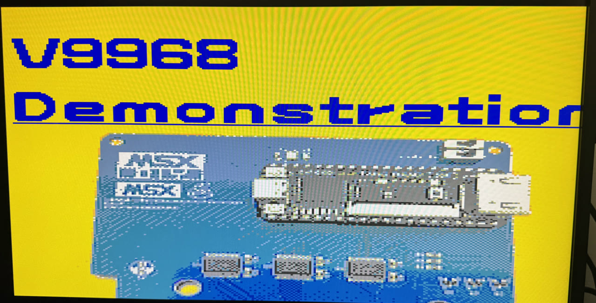
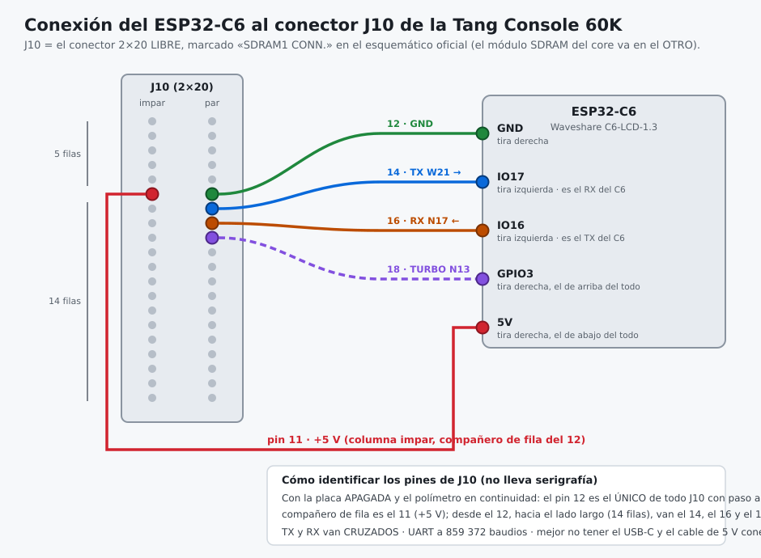
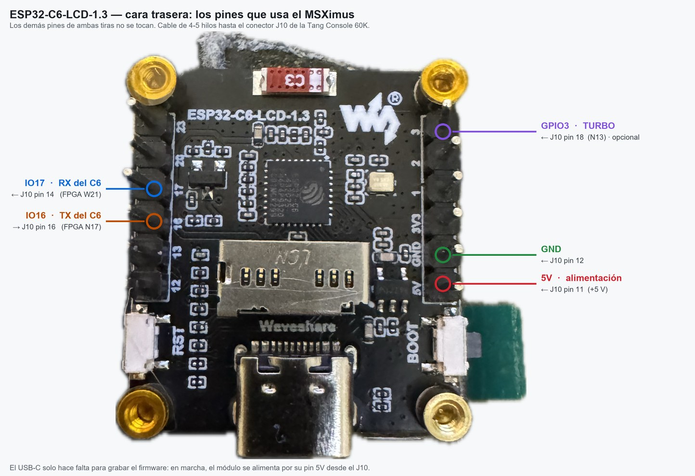
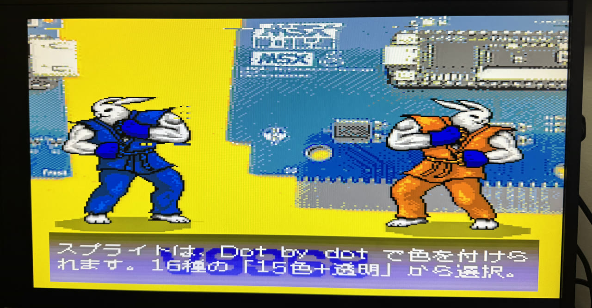

<p align="center"></p>

<h1 align="center">MSXimus</h1>
<p align="center"><b>Un MSX2+ completo, en una Tang Console 60K — ahora con el VDP V9968</b></p>
<p align="center">
  
  
  
</p>

<p align="center">🇬🇧 <a href="README.md">English version</a></p>

<p align="center"></p>
<p align="center"><i>La demo oficial del V9968 de HRA!, corriendo en el MSXimus.</i></p>

---

**MSXimus** es el hermano mayor del [**MSXnano**](https://github.com/Papipapito/MSXnano): el mismo linaje de core MSX2+ (goauld → MSXnano), portado y ampliado sobre la **Tang Console 60K**. *Nano* era el pequeño; *Maximus* es el grande.

No necesita un MSX. Es un MSX.

## Por qué v3.1 y no v2.2

Porque se movió el suelo.

En agosto de 2026 Gowin confirmó que el **SSRAM del GW5AT-60B está retirado a propósito**: hay un problema de silicio en investigación, y su recomendación es migrar a BSRAM o a registros todo lo que lo use.

La v2.1 tiraba mucho de ese recurso — solo los motores de audio se llevaban la mayor parte. Así que la v3 no es la v2.1 con cosas nuevas encima: es el mismo MSX **reconstruido para que no quede ni un bit sobre el recurso retirado**. Cada memoria que vivía ahí se mudó a BSRAM o a registros, y eso obligó a rehacer por dentro el motor wavetable del OPL4, los ficheros de registro del OPL3 y la caché del PCM.

Eso es un cambio en los cimientos, no en la superficie, y merecía número propio. Todo lo que ya conocías funciona exactamente igual; lo que ha cambiado es sobre qué se apoya.

## Qué lleva dentro

**Vídeo** · Salida HDMI 720p a pantalla completa · **V9968** o V9958 · bordes estilo CRT · scanlines conmutables desde el menú

**Audio** · PSG · doble SCC con estéreo · OPLL (MSX-Music) · **MSX-Audio Y8950** con FM y ADPCM-B · **MoonSound / OPL4** completo, FM (OPL3) y wavetable de 24 voces

**Almacenamiento** · Nextor sobre microSD · megaram con Konami4, Konami-SCC, ASCII8 y ASCII16

**Entrada** · Teclado USB directo sin hub, con F1–F10 físicas · gamepads USB mapeados a joystick MSX · ratón USB como ratón MSX

**En pantalla** · **Panel de estado en F12** opcional, en color, pintado sobre el MSX por el BL616 que la placa ya lleva

**Actualizaciones** · Desde el propio MSX, sin PC: `MXUPDATE /N` baja la última versión de internet y la graba; también vale un fichero `.UPD` en la SD

**WiFi** · UNAPI mediante un **ESP32-C6** externo, con **pantalla opcional** para información adicional

**Extras** · Turbo Panasonic 5,37 MHz en **F11** · identificación de máquina estilo turboR · dos BIOS a elegir · logo de arranque · control de ventilador por temperatura · telemetría por puerto serie para diagnóstico

## Hardware necesario

| | Qué | Notas |
|---|---|---|
| **Obligatorio** | [Sipeed **Tang Console 60K**](https://wiki.sipeed.com/hardware/en/tang/tang-console/mega-console.html) | SOM Tang Mega 60K (Gowin GW5AT-60), HDMI, 2× USB-A, microSD, DDR3 |
| **Obligatorio** | Módulo de **SDRAM** de la Console | Es la RAM del MSX; sin él el core no arranca |
| Opcional | **Disipador de 20×20 mm** sobre el SOM | Recomendado: el core va bastante cargado. [Como estos](https://s.click.aliexpress.com/e/_c4WMlpD9) |
| Opcional | **Ventilador de 20×20 mm** de 5 V | Conector **JST de 1,25 mm, 2 pines** — [como este](https://s.click.aliexpress.com/e/_c328rXwB). Se gobierna solo por temperatura |
| Opcional | Teclado y gamepad **USB** | Directos a los USB-A de la placa, sin hub |
| Opcional | **Ratón USB**, con cable | Directo a la placa. ⚠️ Un receptor **inalámbrico** no vale: se presenta como dispositivo compuesto |
| Opcional | **ESP32-C6** (Waveshare C6-LCD-1.3) | Para el **WiFi**, con pantalla opcional de información |
| Opcional | *Nada que comprar* — el **BL616** de la propia placa | Habilita el panel de estado de F12. Hay que grabarle el firmware una vez |

El ventilador no hace falta para funcionar. Si lo pones, el core lo controla solo: mide la temperatura del chip con un termómetro interno y solo sopla cuando toca.

## Instalación

Todo va a la **flash SPI** de la placa, en tres direcciones distintas:

| # | Fichero | Dirección | ¿Obligatorio? |
|---|---|---|---|
| 1 | `MSXimus_v3.8.0b4.fs` | **`0x000000`** | Sí — es el core |
| 2 | Pack de BIOS (`pack_bios_msximus*.bin`) | **`0x400000`** | Sí — sin él no arranca el MSX |
| 3 | `yrw801.bin` | **`0x500000`** | No — solo para MoonSound/OPL4 (la ROM de ondas va como `.bin`: el Programmer de Gowin no acepta `.rom`; si tienes una `yrw801.rom`, cámbiale la extensión) |

Hay dos piezas más, **opcionales**, que no van a esa flash: el firmware del **ESP32-C6** (WiFi) y el del **BL616** (el panel de F12). Cada una tiene su sección más abajo.

**Esto solo hace falta una vez.** Desde la v3.8, las siguientes actualizaciones se hacen desde el propio MSX: ver [Actualizar desde el MSX](#actualizar-desde-el-msx).

**Las herramientas que necesitas**, todas gratuitas y todas oficiales:

| Para | Herramienta |
|---|---|
| Los tres ficheros de arriba | [**Gowin Programmer**](https://www.gowinsemi.com/en/support/download_eda/) (el que viene con el IDE 1.9.12 va bien) |
| ESP32-C6 (WiFi) | [**esptool-js**](https://espressif.github.io/esptool-js/) en el navegador — sin instalar nada — o `esptool` |
| BL616 (panel de F12) | [**Bouffalo Lab Dev Cube**](https://github.com/bouffalolab/bouffalo_sdk) (BLDevCube) |

### Cómo grabarlo

1. Conecta la placa por el **USB-C** y abre el **Gowin Programmer** (va bien el de la versión 1.9.12).
2. Deja que detecte el dispositivo: debe salir el **GW5AT-60**.
3. Para **cada** uno de los tres ficheros, configura una operación de escritura en la **flash SPI externa** (las opciones que empiezan por *exFlash*, no las de SRAM), pon el fichero en *Programming File* y **la dirección de la tabla en el campo de dirección de inicio**.
4. Graba primero el `.fs` y luego los otros dos. El orden entre ellos da igual, pero **las direcciones no**: si el pack no cae exactamente en `0x400000`, el core arranca y se queda en negro.
5. **Apaga y enciende la placa.** Un reset **no** basta: la DDR3 necesita recalibrar desde frío y con un reset caliente puede quedarse colgada.

> Si al arrancar ves la pantalla azul y nada más, casi siempre es (a) el pack en la dirección equivocada, o (b) que no has hecho el ciclo de apagado.

### Sobre el pack de BIOS

La release trae **todo lo necesario**: el core, el pack de BIOS, la `yrw801.bin` del OPL4 y los firmwares. Descargas, grabas y arranca.

Hay **cuatro versiones del mismo pack**: el menú en castellano o en inglés, y el kernel de disco que llevan dentro:

| Pack | Menú | Nextor |
|---|---|---|
| `pack_bios_msximus.bin` | castellano | **2.1.4** — la estable |
| `pack_bios_msximus_en.bin` | inglés | **2.1.4** — la estable |
| `pack_bios_msximus_nextor3.bin` | castellano | **3.0 beta 2** — para probar la beta |
| `pack_bios_msximus_en_nextor3.bin` | inglés | **3.0 beta 2** — para probar la beta |

Si prefieres montarte el pack con tus propias ROMs, está el [**MSXnano Pack Builder**](https://github.com/Papipapito/MSXnano), que arma el fichero con ellas, Nextor incluido.

Sin la `yrw801.bin` el core funciona igual; simplemente no tendrás MoonSound.

### Una sola BIOS, y el menú es un ajuste

Hasta la v3.1 había **dos** packs y tenías que decidir cuál grabar. Ahora hay **uno**, y aquella elección es una casilla en Ajustes.

Al encender, la máquina **arranca el MSX directamente**. Si quieres el navegador de la SD: pulsa **S** al arrancar, marca **«Menu al arrancar»** y `Save & Restart`. Para volver a la salida directa, lo desmarcas. La elección se guarda en la flash de la placa, así que sobrevive al apagón.

Con el menú encendido tienes el navegador de la tarjeta, el lanzador de ROM y DSK y —si has puesto el WiFi— la tecla **F** para buscar y descargar ROMs y discos directamente a la microSD, sin PC.

> Montar un `.dsk` reescribe sectores de un fichero **que ya existe**: no crea entradas de directorio ni asigna clústeres.

Después, mete una microSD con tus ROMs y discos y listo. La forma más fácil de prepararla es **[MSX SD Maker](MSXsdmaker/LEEME.md)**, en este repositorio: un programa para Windows que parte la tarjeta como lo hace Nextor, copia Nextor y una colección de programas (SofaRun, Multi Mente…) y escribe el `AUTOEXEC.BAT`. Para Nextor 3 la release trae además una imagen de tarjeta ya hecha, `MSXimus_SD_Nextor3-beta2_1800MB.zip` (1800 MB, cabe en cualquier tarjeta de 2 GB o mayor): se graba con balenaEtcher o Rufus.

> **Sobre las microSD:** usa una tarjeta **de marca y Clase 10** (Samsung, SanDisk, Kingston...), formateada en **FAT16**. Las tarjetas baratas sin marca leen bien pero rechazan o pierden escrituras en ráfagas sostenidas — lo medimos en placa: una sin marca fallaba escrituras incluso con pausas, y una Samsung EVO+ iba perfecta con el mismo código y la misma geometría. Si las descargas o los guardados fallan, sospecha de la tarjeta primero.

## Actualizar desde el MSX

Desde la v3.8 el MSXimus se actualiza **solo**: el core y el pack de BIOS se graban en la flash de la placa desde el MSX, sin PC y sin programador. La primera v3.8 hay que grabarla con el PC (es la que trae el *puente de la flash*, lo que deja al MSX escribir en ella); a partir de ahí vale cualquiera de estos tres caminos:

| Camino | Qué hace | Hace falta |
|---|---|---|
| `MXUPDATE /N` | Baja la última versión de [msx.barcelona](https://msx.barcelona) y la graba | MSX-DOS 2 o Nextor, y el ESP32-C6 (WiFi) |
| `MXUPDATE fichero.UPD` | Graba un fichero `.UPD` de la SD | MSX-DOS 2 o Nextor |
| Ajustes → **Instalar actualización** | Graba el `MSXIMUS.UPD` de la raíz de la SD | Nada más: sin DOS |

`MXUPDATE.COM` va en la release. Reconoce la placa sola y habla el idioma del menú:

```
MXUPDATE                  graba MSXIMUS.UPD del directorio actual
MXUPDATE fichero.UPD      graba ese fichero
MXUPDATE /C fichero.UPD   solo lo comprueba (cabecera y CRC); no toca la flash
MXUPDATE /N               baja la ultima version y la graba
MXUPDATE /N /R            la completa (core, pack y ondas del OPL4) y ajustes de fabrica
```

Con `/N` eliges la variante (Nextor 2.1.4 o 3, menú en castellano o en inglés), la baja a la SD, la comprueba, pregunta, la graba y relee la flash entera para comprobarla otra vez. Después: **apagar y encender**. La conexión es **TLS con el certificado validado**, con el firmware del C6 de la v3.8, que trae las autoridades de certificación; con uno anterior funciona igual, sin validar, y lo dice.

Todo se comprueba **antes de borrar nada** y la flash se relee al final. Si algo sale mal, el MSX sigue con el core de antes hasta que se apaga, así que basta con repetir; y por el USB-C, con el Gowin Programmer, la placa siempre se puede volver a grabar: así no se puede estropear. Los ajustes guardados se conservan (solo `/R` los borra, a propósito).

Tiempos, porque todo lo hace el Z80: solo el pack, 1,5 minutos; core y pack, 9 minutos; la completa, 15 minutos; más la descarga. Todo lo demás está en el manual: [`docs/manual/11-actualizar.md`](docs/manual/11-actualizar.md).

## El panel de estado — F12 (opcional)

La Console 60K lleva un segundo chip que probablemente no hayas usado nunca: un microcontrolador **BL616**, conectado a la FPGA de fábrica. Dale un firmware y te pinta un panel de estado directamente sobre la imagen del MSX.

Pulsas **F12** y el MSX se congela y sale el panel, en color. Lo pulsas otra vez (o ESC) y la partida sigue exactamente donde estaba. Es de **solo lectura** — no hay menú, ni cursor, ni nada que romper. Enseña lo que el core dice de sí mismo, en el idioma del menú:

```
  MSXimus 60K                 V3.8.0
  MSX
    Z80     3,58 MHz   normal
    Vídeo   V9968 · HDMI 720p
  Tarjeta SD
    SDHC    lista
  Ajustes
    Scanlines      Estéreo
    Segundo SCC
  USB
    Puerto 1  teclado    Puerto 2  mando
  Sistema
    Ventilador        parado
    Bloq. mayúsculas  no
  Actualizar: MXUPDATE /N
  [F12] Volver al MSX
```

Y no te cuesta nada en hardware: **ni cables, ni soldar, ni módulo**. El enlace entre los dos chips (una línea serie a 2 Mbps) ya estaba rutado en la placa; simplemente no se usaba.

> Como el BL616 se queda la F12 para él, esa tecla no llega nunca al MSX. **El turbo está en F11.**

### Grabar el BL616

La release lo trae todo en un ZIP, **`bl616_msximus_v3.8_60k.zip`**: dos imágenes que **conviven** — la de fábrica de Sipeed se queda donde está — y el `.ini` que las graba:

| Fichero | Dirección |
|---|---|
| `bl616_fpga_partner_60kConsole.bin` (de Sipeed) | **`0x0`** |
| `bl616_v3.8.bin` | **`0x40000`** |

1. **Mantén pulsado el botón BOOT mientras enchufas el USB.** Eso mete el chip en modo ISP.
2. Aparece un **puerto COM nuevo** — ese es el BL616. (Listar los puertos antes y después de enchufar es la forma fácil de saber cuál.)
3. Descomprime el ZIP en una carpeta, abre **BLDevCube** y carga su **`flash_prog_cfg.ini`**: ya trae las dos imágenes con sus direcciones, así que no hay que teclearlas.
4. Desenchufa, vuelve a enchufar y haz un ciclo de apagado de la placa.

El modo ISP vive en la ROM del chip, no en su flash, así que funciona pase lo que pase con lo que hayas escrito. **Es la marcha atrás que nunca falla**: por aquí no puedes dejar la placa inservible.

Y si prefieres no grabarlo, no lo grabes: el MSX funciona exactamente igual, simplemente no tendrás el panel de F12.

## Conexión del ESP32-C6 (WiFi)

Opcional — el core funciona igual sin él; simplemente no tendrás WiFi. Son tres o cuatro cables entre el conector **J10** de la placa y el módulo:

<p align="center"></p>

| Pin J10 | Señal | Bola FPGA | ESP32-C6 |
|---|---|---|---|
| **11** | +5 V (alimentación) | — | **5V** (tira derecha, el último) |
| **12** | GND | — | **GND** (tira derecha) |
| **14** | TX (FPGA → C6) | W21 | **IO17** (tira izquierda, el RX del C6) |
| **16** | RX (FPGA ← C6) | N17 | **IO16** (tira izquierda, el TX del C6) |
| **18** | TURBO (FPGA → C6) | N13 | **GPIO3** (tira derecha, el primero) — opcional, solo alimenta el indicador de turbo de la pantalla |

Y así queda del lado del módulo:

<p align="center"></p>

- **J10 es el conector 2×20 libre**, el que el esquemático de Sipeed llama *SDRAM1 CONN.* — **no** el que lleva el módulo de SDRAM que el core necesita.
- **Identificar los pines sin serigrafía**: con la placa apagada y el polímetro en continuidad, **el pin 12 es el único de todo el conector con paso a masa**. Su compañero de fila es el 11 (+5 V), y desde el 12, hacia el lado largo (el que deja 14 filas, no 5), van el 14, el 16 y el 18.
- **La alimentación sale del propio J10** (pin 11 → `5V` del módulo): el USB-C del C6 solo hace falta para grabarle el firmware.
- ⚠️ **Mejor no tener las dos alimentaciones a la vez**. El módulo lleva protección y aguanta, pero al grabar el firmware por USB-C lo recomendable es desconectar el cable de 5 V (o apagar la placa).
- TX y RX van **cruzados**, como siempre. La UART va a 859 372 baudios.
- ⚠️ Si algún día pinchas un segundo módulo de SDRAM en J10, hay que mudar el ESP a otro sitio.

### Grabar el C6

El firmware del módulo y su inventario técnico completo viven en su propio repositorio, [**ESP32-for-FPGA**](https://github.com/Papipapito/ESP32-for-FPGA) — el mismo binario sirve al MSXimus y al MSXnano, así que ya no se guarda una copia aquí. Coge el `firmware_esp32c6_v3.8_merged.bin` de la release y grábalo en el C6 por **su propio USB-C**. El de la v3.8 lleva las autoridades de certificación con las que `MXUPDATE /N` valida el certificado de msx.barcelona (duran hasta 2046: no hay que regrabarlo cuando la web renueva su certificado). **No** hace falta el IDE de Arduino, ni compilar nada: la release trae un único binario ya fusionado.

**Lo fácil — desde el navegador, sin instalar nada.** Abre [**esptool-js**](https://espressif.github.io/esptool-js/), el grabador web del propio Espressif, en Chrome o Edge. Conectas, eliges el fichero, pones la dirección `0x0` y le das a Program. Sin drivers, sin Python, sin IDE.

**Por línea de órdenes**, si ya lo tienes:

```
esptool --chip esp32c6 --port COMx write_flash 0x0 firmware_esp32c6_v3.8_merged.bin
```

> No hay una vía de arrastrar y soltar como el `.uf2` de la Raspberry Pi Pico: el ESP32 no lleva bootloader de almacenamiento masivo en ROM, así que copiar un fichero a una unidad no es posible en **ningún** ESP32. El grabador web de arriba es lo más cerca que se puede estar: una página, dos clics y nada instalado.

## La carcasa

Una carcasa para imprimir en 3D con la forma de un Spectravideo SVI-728, con la Console 60K dentro, una bahía con tapa para el ESP32-C6 y su pantalla, ventilador, y los conectores sacados atrás y al frontal. Deriva de la [SVI-728 Retropie case](https://www.thingiverse.com/thing:4066021) de Palver.

<p align="center"></p>
<p align="center"></p>

El proyecto de Bambu Studio, los STL, los ajustes de impresión y las notas de montaje están en [`carcasa/`](carcasa/README.md).

## Estado

**La v3.8.0b4 es una pre-release**: la v3.8.0b3 con Nextor 3.0 beta 2 (Konamiman, 01/10/2026) en los packs de Nextor 3 (el mismo driver de la beta 1, byte a byte, sobre el kernel nuevo; sin probar todavía en placa). La v3.8.0b3, validada en placa (02/10/2026): el puente lee y graba la flash real, `MXUPDATE /N` baja e instala de msx.barcelona con el certificado validado, y `/R` deja los ajustes de fábrica. Falta probar en placa la fila *Instalar actualización* de Ajustes y la firma de tipo de ROM. La v3.7.6 está validada en hardware (30/09/2026), como la v3.7.5 antes que ella (imagen desde el primer encendido, el navegador de la SD ordenado, un mando USB genérico). La base de la v3.7 se validó con la batería de tests del V9968 de HRA!, las demos DEVCON, Metal Gear 2, Aleste 2 y el catálogo MSX2+ habitual. El V9968 está alineado con la **última revisión publicada** por HRA!; su procedencia y cada parche local están documentados en [`fpga/v9968/ORIGEN.txt`](fpga/v9968/ORIGEN.txt).

## Estructura del repositorio

```
carcasa/         La carcasa imprimible en 3D (3MF, STL, montaje)
docs/            Manual, referencia técnica, histórico, logo, fotos
MSXsdmaker/      MSX SD Maker: prepara la tarjeta SD (programa para Windows + instrucciones)
fpga/            top.v, build.tcl
  v9968/         El VDP V9968 (+ ORIGEN.txt: procedencia y parches locales)
  video720/      Puente HDMI y escalador
  src/           RTL propio (shim de VRAM, backend DDR3, audio, USB, S1990…)
    iosys/       El enlace con el BL616 y el panel en pantalla
  constraints/   Pinout y constraints de la Console 60K
tools/           Testbenches y utilidades de validación
  mxupdate/      MXUPDATE.COM (MSXgl + UNAPI) y su banco Z80
  mxupd.py       Hace los .UPD y el manifiesto de la actualización
```

## Lo nuevo de la v3.8

Versión nueva: cambian el core y el pack. **Graba los dos, una vez, con el PC**; después, las actualizaciones llegan desde el MSX.

- **Actualizar desde el MSX.** Un *puente de la flash* en el core (dispositivo de E/S conmutada 4Dh) deja al MSX leer, borrar y programar la flash de la placa. `MXUPDATE.COM` lo usa: un fichero `.UPD` de la SD, o directamente de internet con `/N` (msx.barcelona, TLS con el certificado validado). `/R` hace la actualización completa (core, pack y ondas del OPL4) y vuelve a los ajustes de fábrica. Y **Ajustes → Instalar actualización** graba el `MSXIMUS.UPD` de la SD sin DOS. Todo se comprueba antes de borrar nada y se relee después. Ver [Actualizar desde el MSX](#actualizar-desde-el-msx).
- **El panel F12 en color**, al estilo del de la MSXimus Z: Z80 y turbo, vídeo, tarjeta SD, los ajustes principales, qué hay en cada USB-A, ventilador, mayúsculas y la orden para actualizar, en el idioma del menú. ESC también lo cierra. (La memoria del panel pasa de 2048×8 a 2048×9 bits: la misma BSRAM, que tiraba un bit de cada nueve.)
- **El mapper por la firma de la propia ROM.** Muchas ROM nuevas llevan su mapper escrito dentro, justo después de la cabecera, según la [convención de MSXgl](https://aoineko.org/msxgl/index.php?title=ROM_type_signature) (`ROM_ASC8`, `ROM_AS16`, `ROM_KON4`, `ROM_KON5`, `ROM_NEO8`, `ROM_NE16`, `ASCII16X`). El menú la lee ahora, por encima de la etiqueta del nombre y del análisis: las ROM de geo3d y lo hecho con MSXgl se lanzan con su mapper, sin `[ASCII16]` en el nombre.
- **El firmware del ESP32-C6 lleva autoridades de certificación** (16 de Mozilla): la placa valida el certificado del servidor de actualizaciones.
- Ajustes y `MXUPDATE` enseñan la versión con tres dígitos: `3.8.0`.
- **Documentación**: dos capítulos nuevos, [`docs/manual/11-actualizar.md`](docs/manual/11-actualizar.md) (cómo actualizar) y [`docs/tecnica/11-actualizacion.md`](docs/tecnica/11-actualizacion.md) (el puente de la flash, el formato `.UPD`, el manifiesto).

## Lo nuevo de la v3.7.6

Tres arreglos del V9968 de HRA!, los mismos que lleva el MSXimus Z (Z1.2.1). Solo cambia el core: **el pack de la v3.7.5 sirve**.

- **Puerto 99h**: un par de bytes de registro a medias se cancela ahora con cualquier lectura del VDP (98h-9Bh) y con una escritura al 98h, como en un V9938/V9958 de verdad. Hasta ahora solo lo cancelaba leer el estado. *Fleet Commander II* escribe un número impar de bytes en el 99h y cuenta con ello; sin esto, todos los registros que escribía después caían en el sitio equivocado. El primer byte de la paleta comparte ese latch, como en openMSX.
- **LMMM, HMMM y YMMM con DIY** (copiando hacia arriba) acaban cuando el **origen** llega a la línea 0, no solo el destino.
- **El paso de píxel de los comandos** se toma al escribir R#46. Es la versión de HRA! de nuestro arreglo de SCREEN 2 de la v3.7.1, y cubre también FG4.
- Ajustes dice `3.7.6` (puerto 29h).
- **[MSX SD Maker](MSXsdmaker/LEEME.md)**, un programa para Windows que prepara la tarjeta SD: particiones FAT16 de 2 o 4 GB como las hace el FDISK de Nextor, o una FAT32; Nextor 2.1.4, Nextor 3 o MSX-DOS; SofaRun, Multi Mente, utilidades y red; y el `AUTOEXEC.BAT` que monta las demás particiones.

## Lo nuevo de la v3.7.5

Todo lo que hay desde la v3.7 ha entrado como arreglos (de la 3.7.1 a la 3.7.5). Cambia el core y cambia el pack: **hay que grabar los dos**.

- **El navegador de la SD va ordenado**: primero las carpetas y después las ROM y los discos juntos, por orden alfabético sin distinguir mayúsculas. Los ficheros ocultos y de sistema no salen (la `System Volume Information` de Windows, las `.Trashes` y los `._nombre.rom` que deja un Mac). Caben 112 entradas por carpeta; si hay más, el contador lo avisa con un `+` (`112/112+`).
- **Mappers de la Zynq**: megaram de 8 MB con **ASCII16-X** (una ROM de más de 4 MB sin firma se detecta sola, así que la V9968 TECH DEMO 0.7.5 arranca tal cual) y **Plain 0000h**. Tras un reset, la ROM relanzada conserva su mapper.
- **V9968**, los arreglos de HRA!: los sprites ya no salen recortados en el borde izquierdo, el scroll horizontal (R#26/R#27) se toma línea a línea y la colisión de sprites salta una vez por línea. HMMM/HMMV/YMMM/HMMC en SCREEN 2 con CMD=1 copian byte a byte (se saltaban uno de cada dos). Se acabaron las rayas de algunos arranques (arreglos de la caché de la VRAM).
- **Mandos USB**: los mandos HID genéricos con Report ID (cruceta, sticks, 12 botones) funcionan en los USB-A, enumeran los mandos que contestan muy deprisa y se acabó la **IZQUIERDA fantasma**: un paquete USB vacío se leía como «eje X = 00», así que los juegos veían la izquierda pulsada y el navegador de la SD saltaba 18 entradas atrás.
- **Ajustes**: `#41` y `#42` confirman solo su propio ajuste (un `#42` suelto desde un programa borraba el otro y podía grabarlo en la flash). ESC sale de Ajustes sin guardar.
- **La versión lleva tercer dígito**: Ajustes dice `3.7.5` (puerto 29h).
- La cinta ya no se queda atascada en «Found:» después de una búsqueda (F) o de configurar la WiFi (W).
- **Packs en inglés** además de en castellano: cuatro packs, menú en inglés o en castellano, con Nextor 2.1.4 o 3.
- Timing: el mux de lectura de la CPU va en árbol (misma prioridad, demostrado con una comprobación formal) y las escrituras a los puertos de configuración y al mapper pasan por una etapa de registro. La síntesis cierra con margen muchas más veces.
- Los firmwares del BL616 y del ESP32-C6 no cambian desde la v3.7.

## Lo nuevo de la v3.7

Cambia el core y cambia el pack: **hay que grabar los dos** (el pack nuevo es obligatorio con este core).

- **Mezclador de audio por chip** en Ajustes: PSG, SCC, OPLL, MSX-Audio, OPL4 FM y OPL4 wave con su propio nivel (0-8), nota de prueba en cada chip y los niveles guardados en la flash. La ganancia maestra de siempre es la primera fila.
- **Tarjeta SD por DMA**: el core copia los sectores a la RAM sin pasar por el Z80 (~640 KB/s, contra ~110 de antes) en el menú, en el análisis de las ROMs y en Nextor.
- **Mandos HID por los dos USB-A** (puerto 1 del MSX). Solo mandos HID genéricos; los XInput (Xbox y compatibles) no.
- **V9968 generación C**: arregla el marcador de *Xevious Fardraut Saga*. El software de la generación B (DEVCON con 0x9F, V9968DM, TECH DEMO 0.7.0) necesita `OUT (9Ch),0` antes de tocar R#20/R#21.
- **El arranque espera a la DDR3 de la VRAM** (hasta 10 s) con reintentos escalonados de la calibración; mientras no ha calibrado, el LED de la SD (U12) parpadea solo. Los puertos 2Ah-2Ch lo cuentan desde BASIC: `PRINT INP(&H2C) AND 127, INP(&H2B)*10, INP(&H2A)/10`.
- Megaram de 4 MB con mappers NEO-8/16, Game Master 2 emulado en el slot 1 (tecla `G`), SRAM guardada en la tarjeta, Nextor 3 beta, ratón USB con cable.
- **Documentación completa** en [`docs/INDICE.md`](docs/INDICE.md): manual de usuario (10 capítulos) y referencia técnica (9).
- BL616: el firmware del panel F12 va con el **host USB apagado** (un cargador USB-C en el OTG no arrancaba la placa con la pila activa); los mandos van por los USB-A del core.

## Lo nuevo de la v3.2

El core **no cambia**: es el mismo `.fs` de la v3.1. Lo que cambia es lo que hay encima.

- **Una sola BIOS** — se acabó elegir pack. El navegador de la SD es ahora una casilla en Ajustes: `S` al arrancar, «Menu al arrancar», y ya. Se guarda en la flash.
- **Descargas desde el menú** — con WiFi, la tecla `F` busca y baja ROMs y discos a la microSD sin pasar por el PC.
- **Logo de arranque en la pantalla del C6** — el logotipo MSX armándose desde los dos lados, como en un MSX2 de verdad.
- **El firmware del C6 vive en su propio repositorio**, [ESP32-for-FPGA](https://github.com/Papipapito/ESP32-for-FPGA), y es el mismo binario para el MSXimus y el MSXnano.

## Lo nuevo de la v3.1

- **Reconstruido fuera del silicio retirado** — el core entero funciona ya sin el SSRAM del GW5AT-60B. Es el titular de la versión y la razón del número; el [por qué](#por-qué-v31-y-no-v22) está arriba del todo.
- **Panel de estado en F12** — el BL616 que la placa ya lleva pinta el estado real de la máquina sobre la imagen, con el MSX congelado debajo. Ni cables, ni módulo, ni hardware extra.
- **Se presenta como un turboR** — están los registros de identificación del S1990 (`E4h`–`E7h`), y `CHGCPU` mueve el turbo de verdad. Sin R800: el mismo Z80, diciendo la verdad sobre lo que es.
- **Ratón MSX con un ratón USB** — enchufa un ratón USB **con cable** a la placa y el software MSX ve un ratón MSX. (Un receptor inalámbrico no vale: se presenta como dispositivo compuesto.)
- **Dos BIOS a elegir** — un MSX a secas, o el mismo más navegador y lanzador de la SD. *(Unificadas en una sola en la v3.2.)*
- **El turbo, en F11** — la F12 es ahora del panel.

Todo lo de la v2.1 sigue aquí: el V9968 en la última revisión de HRA!, el audio remasterizado, el MSX-Audio de 256 KB, la imagen estilo CRT y las megaROMs ASCII16 de 2 MB completas.

## El V9968

El corazón del MSXimus es el **[V9968](https://github.com/hra1129/V9968_Cartridge) de Takayuki Hara (HRA!)**, un VDP imaginario que extiende el V9958 con lo que Yamaha nunca llegó a sacar:

- **Sprites multicolor**: 15 colores más transparencia **por sprite**, definidos píxel a píxel
- **16 sprites por línea** en vez de 8 — se acabó el parpadeo
- **Sprites escalables**, con magnificación libre, rotación y espejado
- **Paleta extendida**: 256 colores en 16 juegos de 16
- **256 KB de VRAM**, comandos extendidos (rotación LRMM, LFMM, LFMC) y modo de comandos rápido

<p align="center"></p>
<p align="center"><i>Sprites de 15 colores definidos píxel a píxel: imposible en un MSX2+ real.</i></p>

La VRAM del V9968 vive en la **DDR3** de la placa, lo que deja la SDRAM entera para la RAM del MSX y para lo que venga después.

Y sigue siendo un MSX2+ normal: el software de siempre funciona igual.

## Licencia

**GPLv3**, por derivación de [`Papipapito/MSXnano`](https://github.com/Papipapito/MSXnano). Ver [LICENSE](LICENSE) y [UPSTREAM.md](UPSTREAM.md) para la atribución completa y la IP de terceros.

El **V9968** es de Takayuki Hara y viene con su licencia propia, tipo BSD pero **no comercial**: se puede redistribuir conservando los avisos y publicar gratis, **pero no vender**. Esa condición se hereda, así que **este proyecto no se vende**.

El logo del MSXimus es del proyecto.

---

# Gracias

Esto no lo he hecho yo solo, ni de lejos. Todo lo que hay aquí se apoya en el trabajo de gente que publicó lo suyo para que otros pudiéramos seguir.

### El core y su linaje

- **[jabadiagm](https://github.com/jabadiagm)** — MSXgoauldSD, el Goa'uld, origen de todo este linaje (goauld → MSXnano → MSXimus), y MSX_LCD_tn20k.
- **Linaje OCM-PLD / ESE Artists' Factory** — Kunihiko Ohnaka, KdL y todos los que han mantenido vivo el MSX2+ en FPGA durante dos décadas. De ahí viene el VDP V9958.

### El V9968

- **[Takayuki Hara — HRA!](https://github.com/hra1129)** — autor del **V9968**, el VDP que hace especial a esta versión, y de la demo DEVCON y de toda la batería de tests con la que se ha validado. Gracias por publicarlo y por documentarlo tan bien.
- **[Albert Herranz — herraa1](https://github.com/herraa1)** — port de la demo a MSXgl (`ru66-v9968-demo`), el cartucho V9968 y el material de referencia que ha permitido depurar el core.

### Audio

- **[Jose Tejada — jotego](https://github.com/jotego)** — jt2413 (OPLL), jtopl2 (FM del Y8950) y jt10_adpcmb. GPLv3.
- **[Greg Taylor — gtaylormb](https://github.com/gtaylormb)** — opl3_fpga (LGPLv3), que incluye `afifo.v` de **Dan Gisselquist (ZipCPU)**.
- **Jokin Miragaia (antxiko)** — mangOPL4, los arreglos para Gowin y las lecciones de integración.
- **srg320** — YMF278B.sv, el motor PCM del OPL4, cedido con permiso expreso.
- **Equipo MAME** — R. Belmont, Olivier Galibert y hap (ymf278b.cpp), y **Aaron Giles** (ymfm).
- **Tatsuyuki Satoh** — el algoritmo ADPCM-B de referencia.

### La placa y la cadena de vídeo

- **[nand2mario](https://github.com/nand2mario)** — `ddr3_framebuffer_gowin` (la receta de la IP DDR3 que hace posible meter ahí la VRAM), `usb_hid_host`, la plantilla de vídeo 720p y, en general, por abrir camino en el ecosistema Tang.
- **hdl-util (Sameer Puri)** — el empaquetador HDMI (MIT).
- **[ducasp](https://github.com/ducasp)** — firmware y protocolo UNAPI del ESP.

### Validación y herramientas

- **Equipo de [openMSX](https://openmsx.org)** — la referencia contra la que se comprueba si algo está bien o mal.
- **Laurens Holst (grauw)** — VGMPlay MSX y la MSX Assembly Page.
- **aoineko (Guillaume Blanchard)** — MSXgl.
- **[Sipeed](https://sipeed.com)** y **Gowin** — la placa y el toolchain.
- **Yamaha** — por los chips originales (V9958, YM2149, YM2413, Y8950, YMF262, YMF278B) que esto emula con cariño.

### Y

- **Claude (Anthropic)** — **coautora del código**: RTL nuevo, el shim de VRAM sobre DDR3, las integraciones de audio, la suite de validación, y una cantidad indecente de horas de depuración a base de simulación, telemetría y equivocarse mucho antes de acertar.

---

<p align="center"><i>Para la comunidad MSX. Que dure otros cuarenta años.</i></p>
