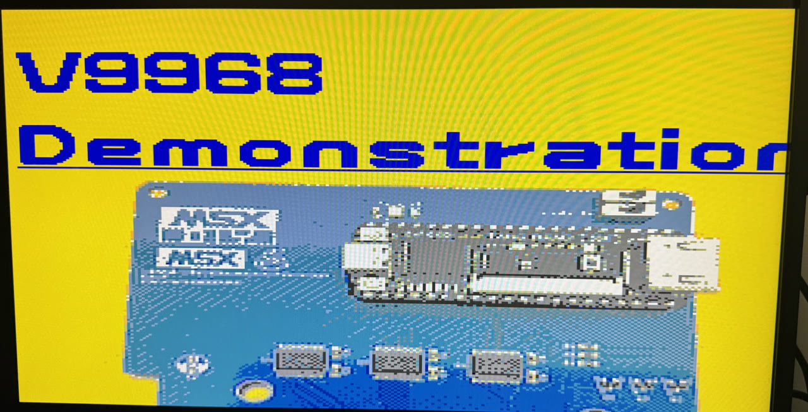
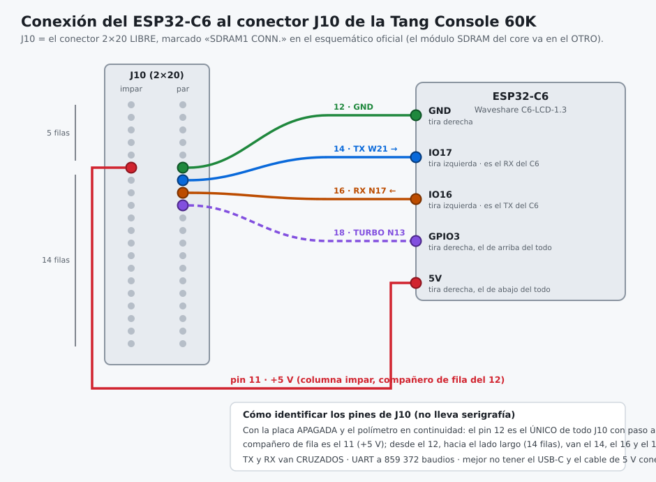
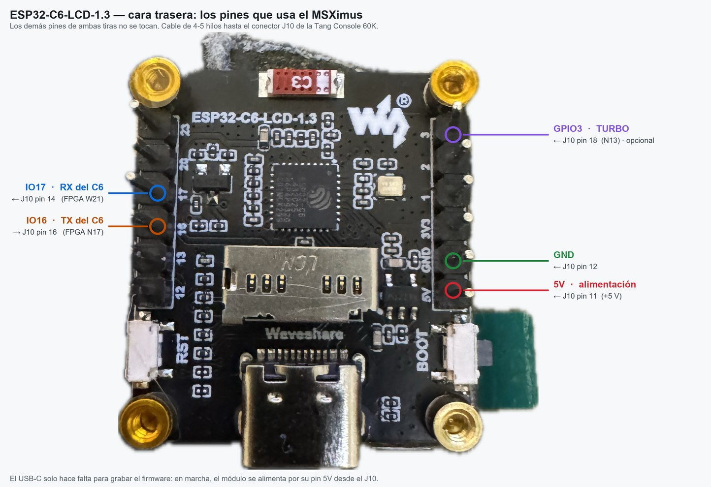
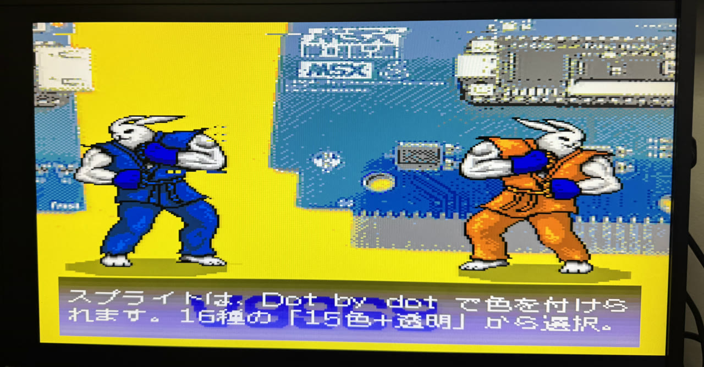

<p align="center"></p>

<h1 align="center">MSXimus</h1>
<p align="center"><b>A complete MSX2+ on a Tang Console 60K — now with the V9968 VDP</b></p>
<p align="center">
  
  
  
</p>

<p align="center">🇪🇸 <a href="README.es.md">Versión en castellano</a></p>

<p align="center"></p>
<p align="center"><i>HRA!'s official V9968 demo, running on the MSXimus.</i></p>

---

**MSXimus** is the big brother of the [**MSXnano**](https://github.com/Papipapito/MSXnano): the same MSX2+ core lineage (goauld → MSXnano), ported to and expanded on the **Tang Console 60K**. *Nano* was the small one; *Maximus* is the big one.

It doesn't need an MSX. It **is** an MSX.

## What's inside

**Video** · Full-screen 720p HDMI output · **V9968** or V9958 · CRT-style borders · scanlines toggle, right from the menu

**Audio** · PSG · dual SCC with stereo · OPLL (MSX-Music) · **MSX-Audio Y8950** with FM and ADPCM-B · full **MoonSound / OPL4**: FM (OPL3) plus 24-voice wavetable

**Storage** · Nextor over microSD · megaram with Konami4, Konami-SCC, ASCII8 and ASCII16 mappers

**Input** · USB keyboard straight into the board (no hub needed), with physical F1–F10 · USB gamepads mapped to MSX joysticks

**WiFi** · UNAPI through an external **ESP32-C6**, with an **optional display** for extra information

**Extras** · 5.37 MHz Panasonic-style turbo · custom boot menu with file browser · boot logo · temperature-driven fan control · serial-port telemetry for diagnostics

## Required hardware

| | What | Notes |
|---|---|---|
| **Required** | [Sipeed **Tang Console 60K**](https://wiki.sipeed.com/hardware/en/tang/tang-console/mega-console.html) | Tang Mega 60K SOM (Gowin GW5AT-60), HDMI, 2× USB-A, microSD, DDR3 |
| **Required** | The Console's **SDRAM** module | It is the MSX's RAM; the core won't boot without it |
| Optional | **20×20 mm heatsink** on the SOM | Recommended: the core keeps the chip busy. [Like these](https://s.click.aliexpress.com/e/_c4WMlpD9) |
| Optional | **20×20 mm 5 V fan** | **1.25 mm JST connector, 2-pin** — [like this one](https://s.click.aliexpress.com/e/_c328rXwB). Fully temperature-controlled by the core |
| Optional | **USB** keyboard and gamepad | Straight into the board's USB-A ports, no hub |
| Optional | **ESP32-C6** (Waveshare C6-LCD-1.3) | For **WiFi**, with an optional info display |

The fan is not needed for operation. If you fit one, the core drives it by itself: it measures the die temperature with an internal thermometer and only spins it when needed.

## Installation

Everything goes into the board's **SPI flash**, at three different addresses:

| # | File | Address | Required? |
|---|---|---|---|
| 1 | `MSXimus_v*.fs` | **`0x000000`** | Yes — this is the core |
| 2 | BIOS pack (`pack_bios_*.bin`) | **`0x400000`** | Yes — the MSX won't boot without it |
| 3 | `yrw801.rom` | **`0x500000`** | No — only for MoonSound/OPL4 |

### How to flash

1. Connect the board over **USB-C** and open the **Gowin Programmer** (the 1.9.12 one works fine).
2. Let it detect the device: it should report a **GW5AT-60**.
3. For **each** of the three files, configure a write operation to the **external SPI flash** (the options starting with *exFlash*, not the SRAM ones), select the file as *Programming File*, and put **the address from the table into the start-address field**.
4. Flash the `.fs` first, then the other two. Their order doesn't matter — **the addresses do**: if the pack doesn't land exactly at `0x400000`, the core boots to a black screen.
5. **Power-cycle the board.** A reset is **not** enough: the DDR3 needs a cold recalibration and may hang after a warm reset.

> If you power up and only get a blue screen, it's almost always (a) the pack at the wrong address, or (b) a missing power-cycle.

### About the BIOS pack

The release **ships the bitstream only**. The pack contains MSX BIOS ROMs, which belong to their owners and cannot be redistributed here — same for `yrw801.rom`, Yamaha's OPL4 wavetable. You must supply them yourself, from an MSX you own or wherever you're licensed to.

To build the pack there's the [**MSXnano Pack Builder**](https://github.com/Papipapito/MSXnano), which assembles the file from your own ROMs, Nextor included.

Without the OPL4 ROM the core works just the same; you simply won't have MoonSound.

After that, insert a microSD with your ROMs and disk images and you're done — the boot menu comes up on its own.

## Wiring the ESP32-C6 (WiFi)

Optional — the core works fine without it; you simply won't have WiFi. Three or four wires between the board's **J10** header and the module:

<p align="center"></p>

| J10 pin | Signal | FPGA ball | ESP32-C6 |
|---|---|---|---|
| **11** | +5 V (power) | — | **5V** (right strip, last one) |
| **12** | GND | — | **GND** (right strip) |
| **14** | TX (FPGA → C6) | W21 | **IO17** (left strip, the C6's RX) |
| **16** | RX (FPGA ← C6) | N17 | **IO16** (left strip, the C6's TX) |
| **18** | TURBO (FPGA → C6) | N13 | **GPIO3** (right strip, first one) — optional, only feeds the display's turbo indicator |

And this is the module side:

<p align="center"></p>

- **J10 is the free 2×20 header**, labelled *SDRAM1 CONN.* in Sipeed's schematic — **not** the one holding the SDRAM module the core needs.
- **Identifying the pins without silkscreen**: with the board powered off and a multimeter in continuity mode, **pin 12 is the only pin on the whole header with a path to ground**. Its row partner is pin 11 (+5 V), and from pin 12 towards the long side (the one leaving 14 rows, not 5) come 14, 16 and 18.
- **Power comes from J10 itself** (pin 11 → the module's `5V`): the C6's USB-C is only needed to flash its firmware.
- ⚠️ **Better not to have both power sources connected at once.** The module has protection and copes fine, but when flashing over USB-C it's advisable to unplug the 5 V wire (or power the board down).
- TX and RX are **crossed**, as usual. The UART runs at 859 372 baud.
- ⚠️ If a second SDRAM module is ever fitted on J10, the ESP has to move elsewhere.

The module's firmware and its full technical inventory live in [`esp32_c6/`](esp32_c6/); flash `firmware_esp32c6_unapi_merged.bin` from the release to the C6 through its own USB-C:

```
esptool --chip esp32c6 --port COMx write_flash 0x0 firmware_esp32c6_unapi_merged.bin
```

## Status

This version has been validated on hardware with HRA!'s V9968 test suite, the DEVCON demos, Metal Gear 2, Aleste 2 and the usual MSX2+ catalogue. The V9968 tracks HRA!'s **latest published revision**; its provenance and every local patch are documented in [`fpga/v9968/ORIGEN.txt`](fpga/v9968/ORIGEN.txt).

## Repository layout

```
docs/            Plans, audits, logo, screenshots
fpga/            top.v, build.tcl
  v9968/         The V9968 VDP (+ ORIGEN.txt: provenance and local patches)
  video720/      HDMI bridge and scaler
  src/           Own RTL (VRAM shim, DDR3 backend, audio, USB…)
  constraints/   Console 60K pinout and constraints
tools/           Testbenches and validation utilities
```

## What's new in v2.1

v2.1 brings the V9968 fully up to date and rounds off the audio and the picture:

- **The V9968, at its latest** — the core now carries HRA!'s most recent published revision of the VDP: the new R#20/R#21 register map (V9958-compatible out of reset), per-sprite palette sets in sprite mode 2 (EPAL) and the command-end interrupt.
- **Remastered audio** — a new gain structure calibrated against real hardware and openMSX: DC blocking on the PSGs, revised per-chip balance, a soft-knee limiter, and a **master volume you set from the MSX itself** (`OUT &H44,n`, 0–7), saved to flash. The MoonSound/OPL4 plays at its reference level.
- **MSX-Audio with 256 KB** — the Y8950's sample RAM grows from 32 to 256 KB, the maximum the real chip can address.
- **A picture closer to a CRT** — the border is visible on all four sides, every pixel comes out uniform (exact integer scaling) and the centering has been fine-tuned.
- **Full 2 MB ASCII16 megaROMs** — Aleste 2 and friends, complete.
- **Rock-solid memory** — the SDRAM refreshes autonomously and the V9968's CPU port honours /WAIT: solid behaviour under any load, from cold boot to the heaviest demo.
- **ESP32-C6 firmware in the repo** — the WiFi module's firmware now lives in `esp32_c6/`, with the J10 pinout documented.

## The V9968

The heart of the MSXimus is **Takayuki Hara's (HRA!) [V9968](https://github.com/hra1129/V9968_Cartridge)**, an imaginary VDP that extends the V9958 with everything Yamaha never got to ship:

- **Multicolor sprites**: 15 colors plus transparency **per sprite**, defined pixel by pixel
- **16 sprites per line** instead of 8 — flicker is over
- **Scalable sprites**, with free magnification, rotation and mirroring
- **Extended palette**: 256 colors in 16 sets of 16
- **256 KB of VRAM**, extended commands (LRMM rotation, LFMM, LFMC) and a fast command mode

<p align="center"></p>
<p align="center"><i>15-color sprites defined pixel by pixel: impossible on a real MSX2+.</i></p>

The V9968's VRAM lives in the board's **DDR3**, leaving the whole SDRAM to the MSX's RAM and to whatever comes next.

And it's still a regular MSX2+: your usual software runs just the same.

## License

**GPLv3**, derived from [`Papipapito/MSXnano`](https://github.com/Papipapito/MSXnano). See [LICENSE](LICENSE) and [UPSTREAM.md](UPSTREAM.md) for full attribution and third-party IP.

The **V9968** belongs to Takayuki Hara and comes under his own BSD-like but **non-commercial** license: it may be redistributed with its notices intact and published for free, **but not sold**. That condition is inherited, so **this project is not for sale**.

The MSXimus logo belongs to the project.

---

# Thanks

I didn't build this alone — not even close. Everything here stands on the work of people who published theirs so others could keep going.

### The core and its lineage

- **[jabadiagm](https://github.com/jabadiagm)** — MSXgoauldSD, the Goa'uld, origin of this whole lineage (goauld → MSXnano → MSXimus), and MSX_LCD_tn20k.
- **OCM-PLD / ESE Artists' Factory lineage** — Kunihiko Ohnaka, KdL and everyone who has kept the FPGA MSX2+ alive for two decades. The V9958 VDP comes from there.

### The V9968

- **[Takayuki Hara — HRA!](https://github.com/hra1129)** — author of the **V9968**, the VDP that makes this version special, of the DEVCON demo and of the whole test suite it was validated against. Thank you for publishing and documenting it so well.
- **[Albert Herranz — herraa1](https://github.com/herraa1)** — the MSXgl demo port (`ru66-v9968-demo`), the V9968 cartridge and the reference material that made debugging the core possible.

### Audio

- **[Jose Tejada — jotego](https://github.com/jotego)** — jt2413 (OPLL), jtopl2 (Y8950 FM) and jt10_adpcmb. GPLv3.
- **[Greg Taylor — gtaylormb](https://github.com/gtaylormb)** — opl3_fpga (LGPLv3), which includes `afifo.v` by **Dan Gisselquist (ZipCPU)**.
- **Jokin Miragaia (antxiko)** — mangOPL4, the Gowin fixes and the integration lessons.
- **srg320** — YMF278B.sv, the OPL4's PCM engine, contributed with express permission.
- **MAME team** — R. Belmont, Olivier Galibert and hap (ymf278b.cpp), and **Aaron Giles** (ymfm).
- **Tatsuyuki Satoh** — the reference ADPCM-B algorithm.

### The board and the video chain

- **[nand2mario](https://github.com/nand2mario)** — `ddr3_framebuffer_gowin` (the DDR3 IP recipe that makes VRAM-in-DDR3 possible), `usb_hid_host`, the 720p video template and, in general, for clearing the path in the Tang ecosystem.
- **hdl-util (Sameer Puri)** — the HDMI packer (MIT).
- **[ducasp](https://github.com/ducasp)** — the ESP UNAPI firmware and protocol.

### Validation and tools

- **The [openMSX](https://openmsx.org) team** — the reference against which right and wrong get decided.
- **Laurens Holst (grauw)** — VGMPlay MSX and the MSX Assembly Page.
- **aoineko (Guillaume Blanchard)** — MSXgl.
- **[Sipeed](https://sipeed.com)** and **Gowin** — the board and the toolchain.
- **Yamaha** — for the original chips (V9958, YM2149, YM2413, Y8950, YMF262, YMF278B) that this project emulates with love.

### And

- **Claude (Anthropic)** — **code co-author**: new RTL, the VRAM-over-DDR3 shim, the audio integrations, the validation suite, and an indecent number of debugging hours built on simulation, telemetry, and being wrong many times before being right.

---

<p align="center"><i>For the MSX community. May it last another forty years.</i></p>
